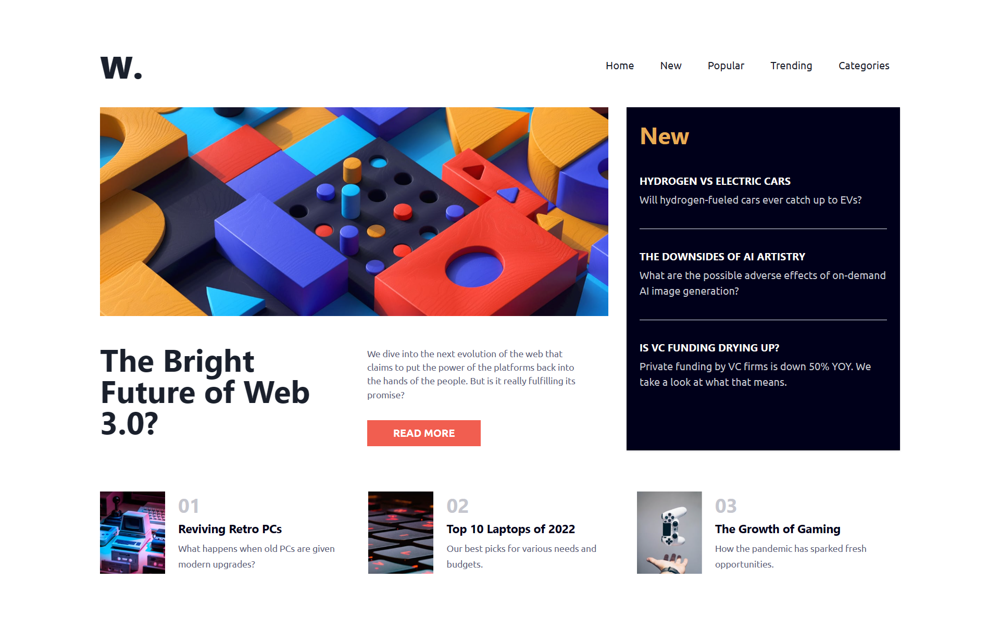
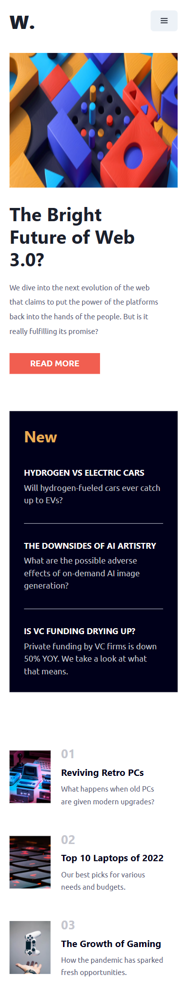

# Frontend Mentor - News homepage solution

This is a solution to the [News homepage challenge on Frontend Mentor](https://www.frontendmentor.io/challenges/news-homepage-H6SWTa1MFl). Frontend Mentor challenges help you improve your coding skills by building realistic projects. 

## Overview

### The challenge

Users should be able to:

- View the optimal layout for the interface depending on their device's screen size
- See hover and focus states for all interactive elements on the page

## Screenshots

### Desktop View

### Mobile View

### Links

- Solution URL: [View Code](https://github.com/abhinav-gif/News-homepage)
- Live Site URL: [Preview Site](https://news-home-page-front.netlify.app/)

## Author

- Frontend Mentor - [@abhinav-gif](https://www.frontendmentor.io/profile/abhinav-gif)
